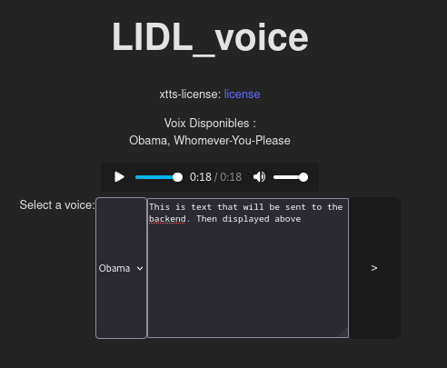

# LIDL_voice



## How to run :

get 5-whatever long second extracts of voices.

## create a conda virtualenv named tts

```bash
conda create -n tts python=3.9
conda activate tts
python -m pip install TTS
conda deactivate
```

## Run LidlVoice
```bash
# open two terminals:
#1:
cd frontend 
npm i
npm run dev
#2:
cd backend
go build
./lidlvoice serve 
```

Go to the Admin UI page displayed by the `./lidlvoice` command.

move your .wav or .mp3 recordings to the `backend/resources/` folder.

Create a collection named `voices`.

Create rows in that collection, with two text columns: `voice_name` and `voice_path`

example data:

```
# voices collection: 
id | voice_name | voice_path
<> | obama      | resources/obama-speech.mp3
```